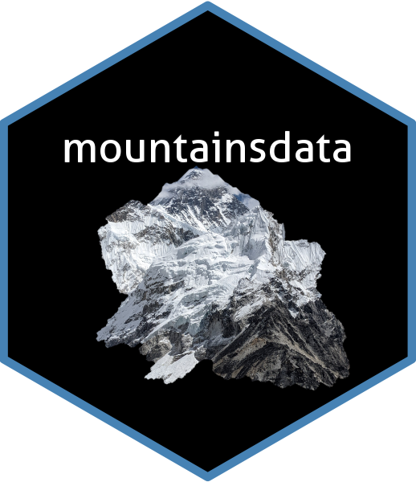

<!-- README.md is generated from README.Rmd. Please edit that file -->

```{r, include = FALSE}
knitr::opts_chunk$set(
  collapse = TRUE,
  comment = "#>",
  fig.path = "man/figures/README-",
  out.width = "100%"
)
```

# mountainsdata 

<!-- badges: start -->
<!-- badges: end -->

The goal of mountainsdata is to provide easy access to data on mountains by elevation. The data is scraped from [Wikipedia](https://en.wikipedia.org/wiki/List_of_mountains_by_elevation). The two data frames can be joined by "id".

## Installation

You can install the development version of mountainsdata from GitHub with:

``` r
# install.packages("devtools")
devtools::install_github("mathiselling/mountainsdata")
```

## Example

This is a basic example which shows you how to solve a common problem:

```{r example, message=FALSE}
library(mountainsdata)
library(tidyverse)

# Check geocoding results

df_mountains_geo <- mountains %>% 
  inner_join(coordinates, by = join_by(id)) %>% 
  mutate(
    mountain_and_country = paste(mountain, country, sep = " in ")
  )

check_geo_results <- function() {
  df_mountains_geo %>%
    slice_sample(n = 1) %>%
    { ggplot(data = ., aes(x = long, y = lat)) +
        borders() +
        coord_fixed(ratio = 1.1) +
        geom_point(color = "blue", size = 2) +
        labs(title = .$mountain_and_country) +
        theme_minimal()
    }
}

check_geo_results()
```
